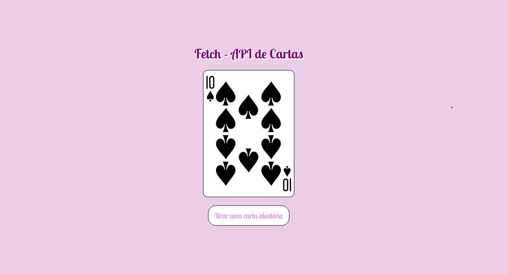
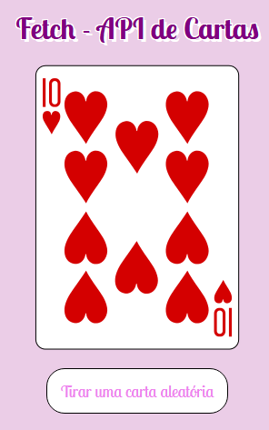

# Site Com Integração à API Pública de Cartas

## Descrição

Projeto criado para fixação de conceitos aprendidos no módulo avançado de JS do Dev Quest - FrontEnd!

## Conceitos trabalhados e fixados no projeto:

* Estrutura de pastas padrão no projeto; ✅
* HTML Semântico; ✅
* Display Flex; ✅
* Responsividade; ✅
* Conceitos de código assíncrono no JS (funções assíncronas e await); ✅
* Uso de funções; DOM; eventos e método fetch(url) no JS ✅

## Design Desktop

    

## Design Mobile

    

